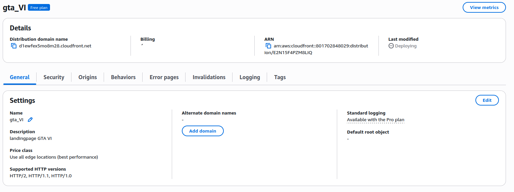

# Landing Page - GTA VI

## Descripción del sitio web y del pipeline configurado.

Es una "Landing Page" (página de aterrizaje) temática de GTA VI, construida de manera estática y moderna. Para su desarrollo, utiliza:

Astro: El framework principal, ideal para sitios web estáticos y rápidos.
Tailwind CSS: Utilizado para el diseño y los estilos de la interfaz de manera ágil.
GSAP (GreenSock): Una librería robusta para incorporar animaciones fluidas y avanzadas en el sitio.

## 1. Capturas de pantalla que demuestren:

### 1.1. El bucket S3 creado y configurado para hosting web.

### 1.2. Los secretos y variables configurados en GitHub.

### 1.3. El historial de ejecuciones en la pestaña Actions (al menos un éxito y un fallo intencional corregido).

### 1.4. El sitio web funcionando accesible públicamente (URL de S3 y CloudFront).

    http://gta-vi-landing.s3-website-us-east-1.amazonaws.com/

## 2. La distribución de CloudFront configurada.

## 3. La URL pública completa donde se puede acceder al sitio web.

http://gta-vi-landing.s3-website-us-east-1.amazonaws.com/

## 4. Conclusiones sobre la utilidad del despliegue continuo para sitios estáticos.

La implementación de un pipeline de despliegue continuo (CI/CD) para sitios web estáticos, como se demostró en este laboratorio, ofrece beneficios significativos en el ciclo de desarrollo:

1. **Automatización y Eficiencia:** Elimina la necesidad de compilar el proyecto manualmente (`pnpm run build`) y subir los archivos uno a uno a través de la consola de AWS o un cliente FTP. Cada vez que el código se integra en la rama principal, la actualización en vivo es automática, ahorrando un valioso tiempo de operación.
2. **Reducción de Errores Humanos:** Al estandarizar el proceso de construcción y despliegue a través de GitHub Actions, se garantiza que siempre se ejecuten los mismos pasos en un entorno limpio. Esto evita problemas causados por dependencias locales faltantes o descuidos manuales al subir archivos ("funciona en mi máquina").
3. **Despliegues Rápidos y Frecuentes:** Facilita la iteración continua. Cualquier ajuste rápido (como un cambio en el diseño con Tailwind o nuevos textos de la Landing Page de GTA VI) llega a los usuarios en cuestión de minutos y sin tiempos de inactividad perceptibles.
4. **Seguridad y Control de Acceso:** Al delegar el proceso de despliegue a GitHub Actions y utilizar `Secrets`, las credenciales críticas (como los Access Keys del usuario IAM en AWS) nunca se exponen en el código fuente ni tienen que distribuirse entre todos los desarrolladores.
5. **Sinergia con Arquitecturas Cloud (CloudFront + S3):** La automatización complementa a la perfección la infraestructura Serverless. Usar S3 para el almacenamiento, respaldado por CloudFront como CDN (Content Delivery Network), provee una solución altamente escalable, de costo casi nulo y con una latencia mínima para usuarios en todo el mundo.
