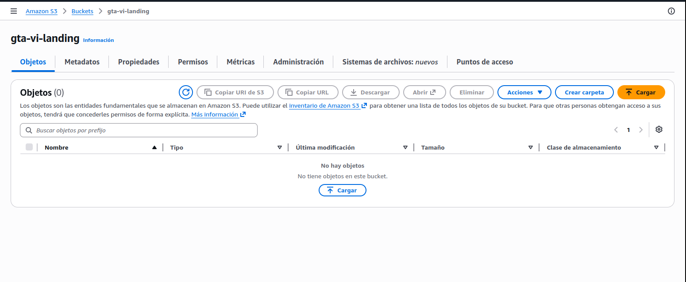
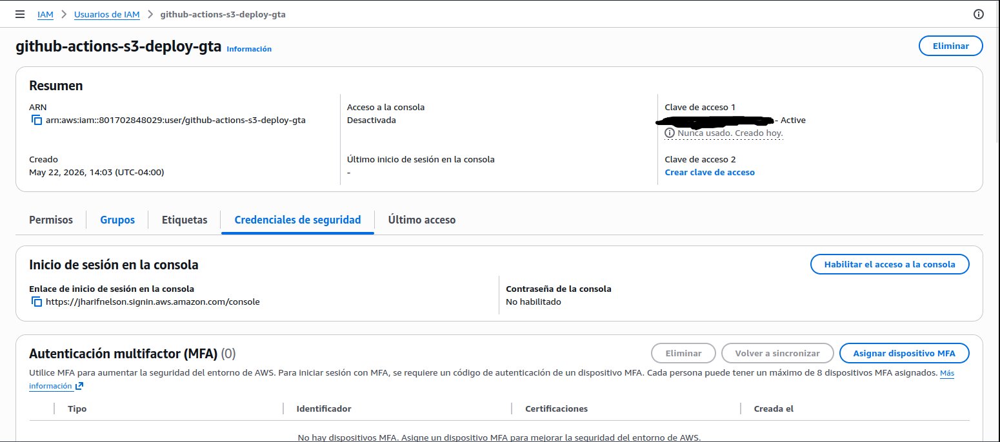
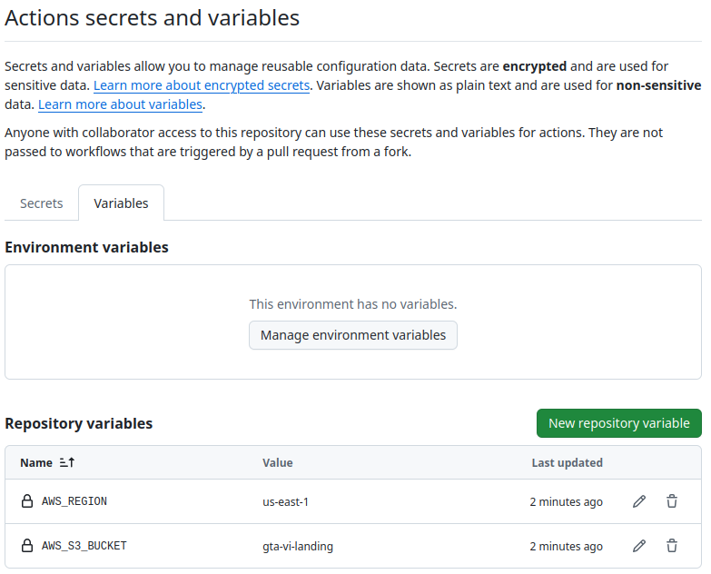
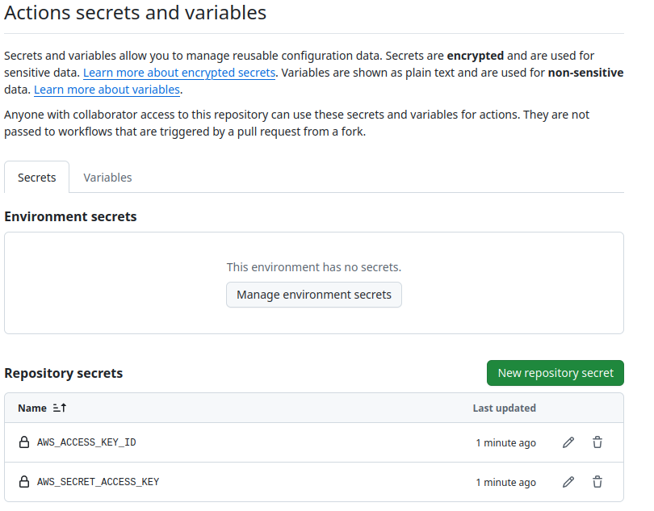

# Landing Page - GTA VI

## Descripción del sitio web y del pipeline configurado.

Es una "Landing Page" (página de aterrizaje) temática de GTA VI, construida de manera estática y moderna. Para su desarrollo, utiliza:

Astro: El framework principal, ideal para sitios web estáticos y rápidos.
Tailwind CSS: Utilizado para el diseño y los estilos de la interfaz de manera ágil.
GSAP (GreenSock): Una librería robusta para incorporar animaciones fluidas y avanzadas en el sitio.

## 1. Capturas de pantalla que demuestren:

### 1.1. El bucket S3 creado y configurado para hosting web.

### 1.2. Los secretos y variables configurados en GitHub.

### 1.3. El historial de ejecuciones en la pestaña Actions (al menos un éxito y un fallo intencional corregido).

### 1.4. El sitio web funcionando accesible públicamente (URL de S3 y CloudFront).

## 2. La distribución de CloudFront configurada.

## 3. La URL pública completa donde se puede acceder al sitio web.

## 4. Conclusiones sobre la utilidad del despliegue continuo para sitios estáticos.
